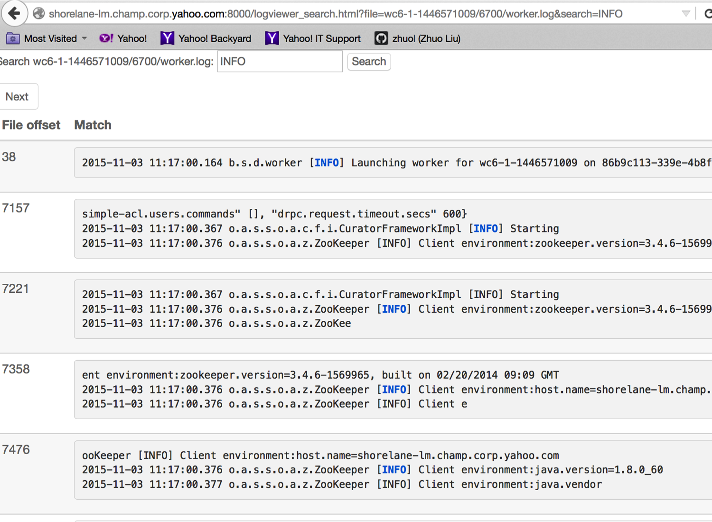
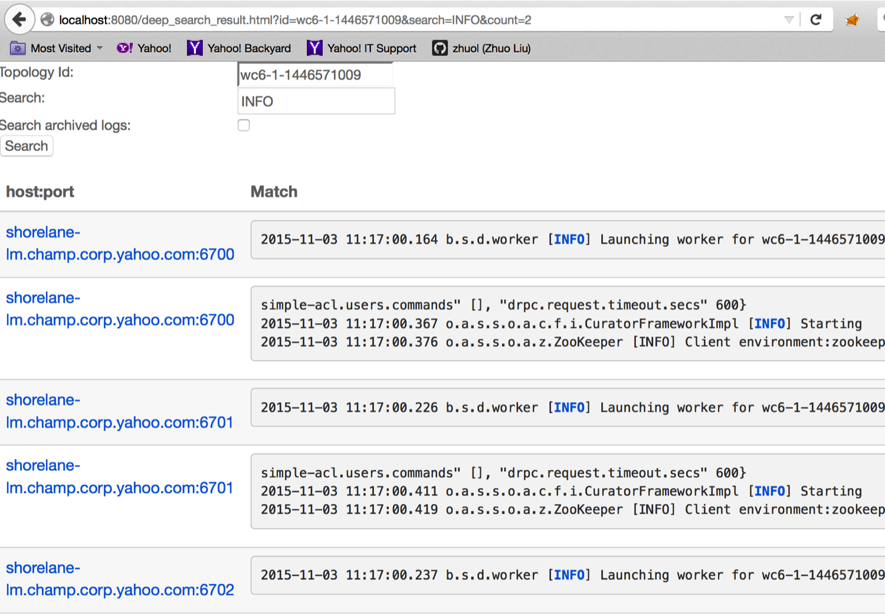

日志在storm中对于跟踪状态、操作、错误信息和调试信息至关重要 对于所有的守护进程(e.g.,nimbus,supervisor,logviewer,drpc,ui,pacemaker)和拓扑作业人员也是一样重要。

### 日志的位置
所有的守护进程都会在${storm.log.dir}这个目录下面，管理员可以在系统属性或者在集群中配置，默认，${storm.log.dir} 指向的是${storm.home}/logs目录. 

所有的工作日志的位置在worker-artifacts目录下面以分级的方式存在，例如，${workers-artifacts}/${topolopgyId}/${port}/workder.log.用户可以通过配置参数"storm.workers.artifacts.dir"来设置worder-artifacts目录的位置，其中，worker-artifacts目录的默认位置是${storm.log.dir}/logs/workers-artifacts.

### 使用storm UI 进行日志查看/下载和日志搜索
授权用户允许守护进程和工作日志通过Storm UI 进行查看和下载

为了改善Storm的调试，我们提供了log Search的功能.
Log Search 支持在某些日志文件或是在所有的拓扑日志文件中搜索：
字符串搜索日志文件：在工作日志页面中，用户可以在某个工作日志中搜索某些字符串，比如：“Exception”。
这种搜索方式通常会发生在正常文本日志或滚动的zip日志文件中。在结果中将会显示出偏移和匹配的行数。

在拓扑中搜索：用户同时也可以通过单击UI 页面的又上角的放大镜图标来某个拓扑的字符串。这意为着UI将尝试着以分布式的方式在所有主节点上搜索，以便在此拓扑的所有日志中查找匹配的字符串。通过检查/取消选中"搜索归档日志"：box，可以对普通文本日志文件或滚动的zip日志文件进行搜索。然后将匹配的结果显示在具有url链接的UI页面上，
将用户指向每个主节点上的某些日志。这个强大的功能非常有助于用户找到运行此拓扑上的某些有问题的主节点。

